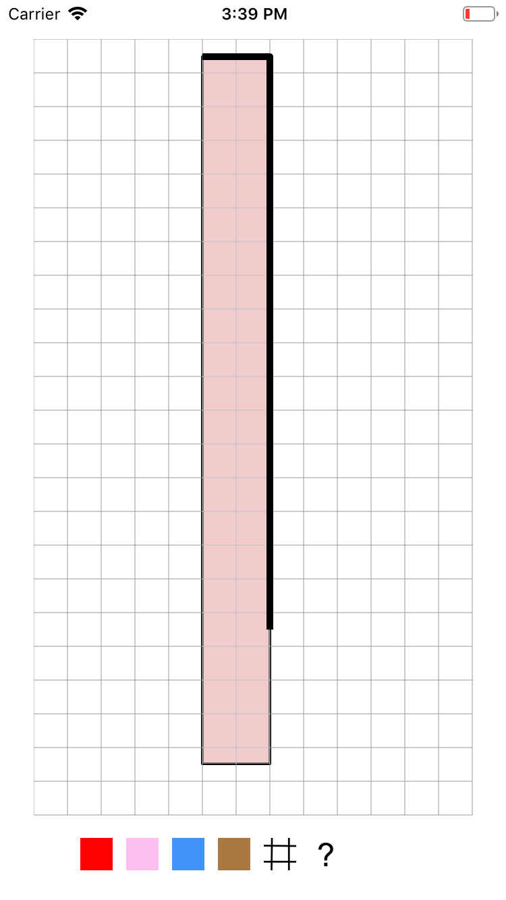

# baby-shape-swipe

Shape flashcards for parents and kids

Version 1.0
Copyright 2018 Steven Mycynek

## Basics

Tap, swipe, or shake to see different shapes and colors.

* Swipe in different directions to get squares, rectangles, triangles, circles, or elipses.
* Tap to get a random shape.
* Two-touch tap to toggle the grid on and off.
* Shake to toggle between bold and pastel colors.

## Background

One of my interests is teaching kids about geometry.  One thing I've noticed is that most TV shows, online cartoons, and apps
have a lot of 'noise' -- animations, sound effects, and worst of all, pop-up advertisements.  As a parent, I value something a bit more understated, simple, and most of all, quiet :).  

You supply the soundtrack by looking at shapes with your child, asking them questions about them, and pointing out their dimensions, orientations and colors.  The triangle shapes are especially interesting, as the random combinations go beyond the simple "equilateral triangle with its base parallel to the bottom of the screen," so kids can learn to recognize them in different orientations. In a future release, I'd like to support squares and rectangles on angles as well as trapezoids, and parallelograms.

## Building

This app is 100% Swift with no extra libraries, so it should build relatively easily in XCode 10.  After I finish all the icons and other artwork, I'll submit it to the app store.

I work on this in small 5 minute increments while learning Cocoa and Swift, so not all the code is as 'best practice' as I'd like, but it's getting there.
